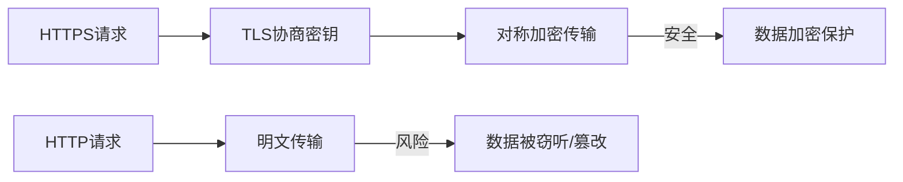
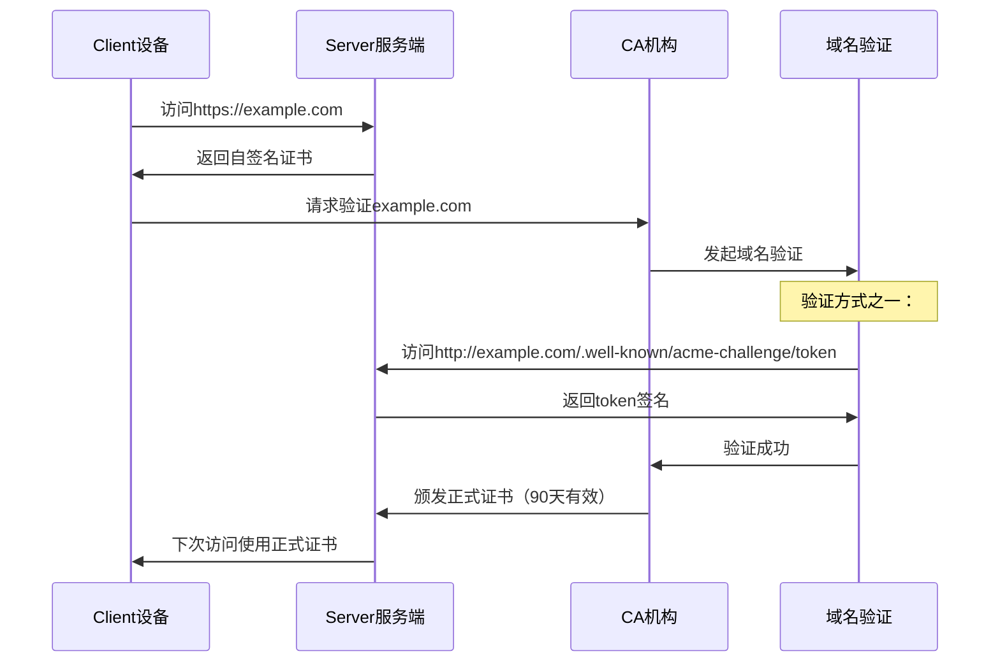
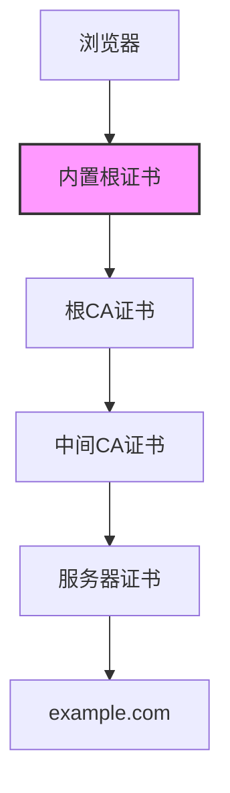

# HTTPS加密与数字证书

> **来源**：字节跳动一面面试题（掘金面试记录）
> **难度**：⭐⭐⭐
> **考察频率**：75%（大厂前端基础必考）

---

## 题目

### 原题问法
1. **阐述 HTTPS 和 HTTP 的主要区别**
2. **HTTPS 加密后会不会被攻击？有了解过吗？**
3. **数字证书的作用和工作原理是什么？**

---

## 💡 参考答案

### 1. HTTP vs HTTPS 核心区别

#### **协议层面对比**

| 对比维度 | HTTP | HTTPS |
|---------|------|-------|
| **协议本质** | 明文传输协议 | 加密传输协议 |
| **默认端口** | 80 | 443 |
| **安全性** | 无加密，数据易被窃听和篡改 | SSL/TLS加密传输 |
| **是否需要证书** | 不需要 | 需要数字证书（CA颁发） |
| **建立连接** | TCP三次握手 | TCP三次握手 + TLS四次握手 |
| **传输效率** | 较高（无加密开销） | 稍低（有加密计算开销） |

#### **详细解析**



---

### 2. HTTPS 加密机制详解

#### **HTTPS = HTTP + SSL/TLS**

HTTPS通过在HTTP和TCP之间加上一个SSL/TLS层，实现了：

1. **加密（Encryption）** - 防止被窃听
2. **完整性（Integrity）** - 防止被篡改  
3. **认证（Authentication）** - 防止被冒充

#### **混合加密体系**

```javascript
// HTTPS采用的混合加密体系：
// 1. 非对称加密（握手阶段）
// 2. 对称加密（数据传输阶段）

// 流程示意图
Client         Server
  |               |
  |--ClientHello-->|
  |<--ServerHello--|
  |<-Certificate---|    // 非对称加密：传递对称加密密钥
  |---ClientKeyExchange|
  |===ChangeCipherSpec==>  // 切换到对称加密
  |<===ApplicationData==>  // 对称加密：高效数据传输
```

---

## 🔐 HTTPS 会被攻击吗？

### **会的！HTTPS仍有被攻击的风险**

#### **主要的攻击手段：**

1. **中间人攻击（Man-in-the-Middle, MITM）**
   ```
   客户端       中间人        服务器
     |——————> 窃听、篡改 ————>|
     |<————— 伪造证书 ——————|
   ```

2. **证书伪造攻击**
   - 攻击者伪造一个与目标网站相似的证书
   - 利用用户不仔细检查证书细节的心理

3. **降级攻击**
   - 迫使客户端和服务端使用不安全的旧版本SSL/TLS
   - 利用旧协议中的漏洞

4. **协议实现漏洞攻击**
   - OpenSSL心脏出血漏洞（Heartbleed）
   - RSA导出密钥攻击

#### **防御措施：**

1. **配置安全的TLS版本**
   ```nginx
   # Nginx配置示例
   ssl_protocols TLSv1.2 TLSv1.3;  # 禁用TLS 1.0和1.1
   ssl_ciphers ECDHE-RSA-AES128-GCM-SHA256; # 强加密套件
   ```

2. **使用HSTS（HTTP严格传输安全）**
   ```http
   Strict-Transport-Security: max-age=31536000; includeSubDomains
   ```

3. **证书透明度（Certificate Transparency）**
   - 所有颁发的SSL证书公开记录
   - 任何人都可以检查证书是否被恶意签发

---

## 📜 数字证书详解

### **数字证书的核心作用**

1. **身份验证**：证明网站所有者的真实身份
2. **公钥分发**：安全地将服务器公钥传给客户端
3. **建立信任**：通过CA（证书颁发机构）传递信任

### **证书包含内容**

```json
{
  "版本": "证书版本号",
  "序列号": "CA颁发的唯一标识",
  "签名算法": "用于验证签名的算法",
  "颁发者": "CA的名称",
  "有效期": {
    "开始时间": "YYYY-MM-DD HH:MM:SS",
    "结束时间": "YYYY-MM-DD HH:MM:SS"
  },
  "主体": "网站域名或公司信息",
  "主体公钥信息": "服务器的公钥",
  "扩展信息": ["密钥用法", "增强密钥用法", "主题备用名称"],
  "签名": "CA对该证书的签名"
}
```

### **证书验证流程**

```typescript
// TypeScript伪代码描述验证流程
async function verifyCertificate(
  certificate: Certificate,
  caCertificate: Certificate
): Promise<boolean> {
  // 1. 验证证书签名
  const isValidSignature = await verifySignature(
    certificate,
    caCertificate.publicKey
  );
  
  // 2. 检查证书有效期
  const isInValidPeriod = checkValidityPeriod(certificate);
  
  // 3. 检查域名匹配
  const isDomainMatch = checkDomainMatch(certificate, requestedDomain);
  
  // 4. 检查证书吊销状态（CRL/OCSP）
  const isNotRevoked = await checkRevocationStatus(certificate);
  
  return isValidSignature && isInValidPeriod && isDomainMatch && isNotRevoked;
}
```

---

## 🏭 数字证书颁发流程

### **证书申请和颁发过程**

> 以Let's Encrypt为例（ACME协议）



### **不同类型的证书**

| 证书类型 | 验证级别 | 签发时间 | 适合场景 |
|---------|---------|---------|---------|
| **DV证书** | 域名验证 | 几分钟 | 个人网站、博客 |
| **OV证书** | 组织验证 | 1-3天 | 企业官网 |
| **EV证书** | 扩展验证 | 1-7天 | 金融、电商网站 |
| **自签名证书** | 无验证 | 立即 | 内部系统、测试环境 |

---

## ⚡ 字节跳动面试深度追问

### **高频追问1：HTTPS 建立连接的详细过程？**

```javascript
// TLS 1.2 四次握手流程
1. Client Hello
   - 客户端支持的TLS版本
   - 客户端支持的加密套件(Cipher Suites)
   - 客户端随机数(Client Random)
   - Session ID（可选的会话恢复）

2. Server Hello
   - 服务端选择的TLS版本
   - 服务端选择的加密套件
   - 服务端随机数(Server Random)
   - Session ID

3. Certificate (服务端证书)
   - 服务器的数字证书
   - 证书链（可选）

4. Server Key Exchange (可选)
   - RSA时不需要
   - DH算法时需要

5. Server Hello Done
   - 服务端准备完毕

6. Client Key Exchange
   - 客户端生成预主密钥(Pre-Master Key)
   - 用服务器公钥加密后发送

7. Change Cipher Spec
   - 双方切换到协商好的加密套件

8. Finished
   - 验证握手消息的完整性
```

### **高频追问2：什么是对称加密和非对称加密？各自优缺点？**

**对称加密**
- **优点**：加密解密快，适合大数据量加密
- **缺点**：密钥分发困难，需要安全通道传输密钥
- **常用算法**：AES、DES、3DES、RC4
- **HTTPS中使用**：数据传输阶段

**非对称加密**
- **优点**：密钥分发方便，公开公钥即可
- **缺点**：计算量大，速度慢
- **常用算法**：RSA、ECC、DSA
- **HTTPS中使用**：握手阶段传递对称加密密钥

### **高频追问3：什么是CA？浏览器如何信任证书？**

**CA（Certificate Authority）作用**
- 审核申请者身份
- 颁发和管理数字证书
- 维护CRL（证书吊销列表）
- 提供OCSP（在线证书状态协议）服务

**浏览器信任链**


---

## 🛠️ 实战应用场景

### **场景1：开发环境配置HTTPS**

```bash
# 1. 生成自签名证书（开发环境）
openssl req -x509 -newkey rsa:2048 -keyout key.pem -out cert.pem -days 3650

# 2. Node.js Express服务器配置
import express from 'express';
import https from 'https';
import fs from 'fs';

const app = express();
const options = {
  key: fs.readFileSync('key.pem'),
  cert: fs.readFileSync('cert.pem')
};

https.createServer(options, app).listen(443);
```

### **场景2：前端处理HTTPS证书错误**

```javascript
// 生产环境：严格检查证书
// 开发环境：可适当放宽（谨慎使用）

// 处理自签名证书错误（仅限开发环境）
if (process.env.NODE_ENV === 'development') {
  process.env.NODE_TLS_REJECT_UNAUTHORIZED = '0'; // 不推荐！
}

// 更好的方案：配置自签名证书信任（开发环境）
import fs from 'fs';
import https from 'https';

const agent = new https.Agent({
  ca: fs.readFileSync('./path/to/local-cert.pem'),
  rejectUnauthorized: true // 仍然拒绝无效证书，但信任自己的
});
```

---

## 💡 面试答题技巧

### **加分回答**
1. **分层描述**：先讲HTTP/HTTPS区别，再深入加密机制
2. **流程框图**：能画出TLS握手全过程
3. **结合实际**：能举出HTTPS实际应用场景
4. **持续学习**：了解最新的TLS 1.3特性

### **常见误区**
- ❌ "HTTPS就是比HTTP更安全的HTTP"
- ❌ "HTTPS完全不会被攻击"
- ❌ "数字证书只是用来加密的"
- ❌ "所有证书都一样，随便找个免费的就行"

### **正确答案要点**
1. HTTPS = HTTP + TLS/SSL加密层
2. HTTPS采用混合加密（非对称+对称）
3. 数字证书主要用于身份验证和公钥分发
4. HTTPS仍有风险，需要持续维护安全配置

---

**本题总结**：HTTPS是前端工程师必须掌握的传输层安全知识，字节跳动特别注重候选人对安全原理的深入理解，而非简单的API使用。